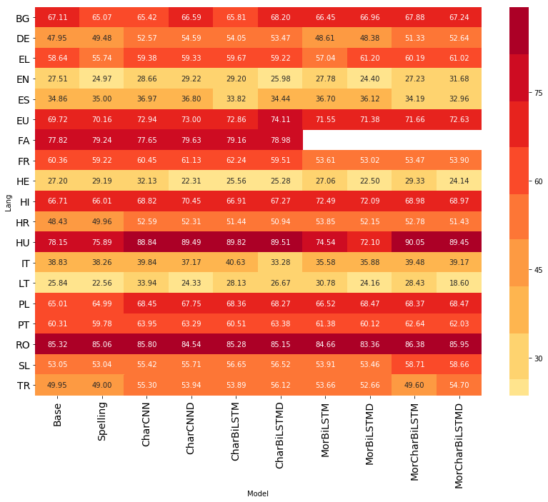

## Identification of Verbal Multiword Expressions Using Deep Learning Architectures and Representation Learning Methods

- This repository contains the source code of my master's thesis. The thesis report is available at  https://drive.google.com/file/d/15_Vi6RJ0Zy_m-Yln9d4LnBISkHVfXWW5/view . 
- The details of the first three parts of the thesis are available in the Deep-BGT repository: https://github.com/deep-bgt/Deep-BGT. 
- This repo contains the details of the representation learning methods used for VMWE identification. I compare character-level CNNs and character-level BiLSTM networks. Also, I analyze two different input schemes to represent morphological information using BiLSTM networks.
- I use the [PARSEME VMWE Corpora Edition 1.1](http://multiword.sourceforge.net/PHITE.php?sitesig=CONF&page=CONF_04_LAW-MWE-CxG_2018___lb__COLING__rb__), the [fastText word embeddings](https://github.com/facebookresearch/fastText/blob/master/docs/crawl-vectors.md) and the bigappy-unicrossy tagging scheme.
- The corpora covers 19 languages:
          Bulgarian (BG), German (DE), Greek (EL), English (EN), Spanish (ES), Basque (EU), Farsi (FA), French (FR),
          Hebrew (HE), Hindu (HI), Crotian (HR), Hungarian (HU), Italian (IT), Lithuanian (LT),
           Polish (PL), Portuguese (PT), Romanian (RO), Slovenian (SL), and Turkish (TR).

## Requirements

Setup with virtual environment (Python 3):
```
python3 -m venv vmwe_venv
source vmwe_venv/bin/activate
vmwe_venv/bin/pip3 install -r requirements.txt
```
## Usage:

          .
          ├── data
          |   ├── corpora
          |       ├── sharedtask-data-master
          |           └── 1.1
          ├── results
          |   ├── 01
          |       ├── ES
          |           └── 1
          ├── src
          └── Runner.py
```
python Runner.py -l BG -t gappy-crossy -cp data/sharedtask-data-master/1.1 -ep data/embeddings -op results -model 05 -exp 1
```
## Language-specic MWE-based F-measure scores 

## Cross-lingual phenomenon-specic MWE-based F-measure scores

